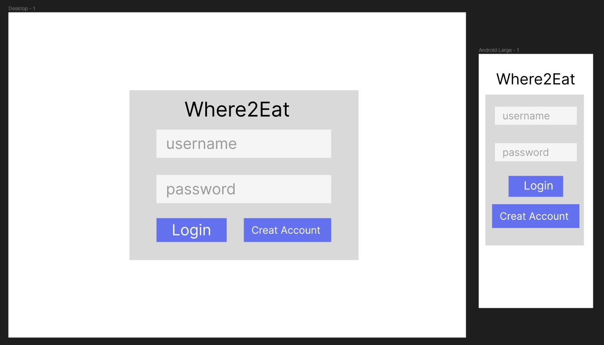
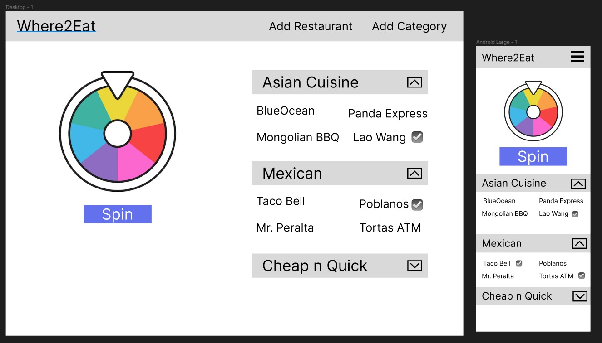

### Your group members and scrum leader (if applicable) 
Devin Raleigh

### Your project idea 
It's been a long day of work and you don't feel like cooking. Your brain is also too tired to make a decicion. Where2Eat will pick for you.
You can select a few places that sound good tonight from your saved list of restaurants and Where2Eat will do the rest.

### Your tech stack (frontend, backend, database)
React frontend with Django Rest Framework backend and PostgreSQL database.

### List of backend models and their properties
Category and Restaurant with a many to many relationship. A category can have many restaurants and a restaurant can belong to more than one category.
Taco Bell is Mexican (sort of) but could also be listed under Fast Food category or Cheap n Fast.

#### Category
     title = models.CharField(max_length=150)
     restaurants = models.ManyToManyField(Restaurant)
  
#### Restaurant
     name = models.CharField(max_length=150)  

### React component hierarchy (if applicable)
- App
  - LogIn
  - SignUp
  - Home
    - Spinner (stretch)
    - CatgoryList
      - Restaurant
      - AddCategory
      - AddRestaurant
    - Yelp (stretch)
      - SearchBar
      - YelpList
    
### User stories

MVP
- As a user I would like to add restaurants I like and store them so I can have a saved list of my restaurants.
- As a user I would like to put those restaurants in categories so that it is more organized.
- As a user I would like to select from my restaurants list the restaurants I am in the mood for right now.
- As a user I would like the application to randomly select a restaurant from those I am in the mood for so I don't have to pick.

Stretch
- As a user I would like a wheel of fortune like spinner to make picking fun.
- As a user I would like to login and have my restaurant list saved and personal.
- As a user I would like to see suggestions of nearby restaurants that I can add to my list.

### Wireframes

### Anything else your squad lead should know
